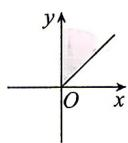
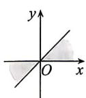
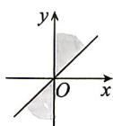
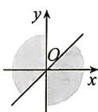

<!-- question-source:start -->
9. 若角 $\alpha$ 的顶点与原点重合, 始边与 $x$ 轴的非负半轴重合, 则集合 $\{\alpha \mid k \cdot 180^{\circ} + 45^{\circ} \leqslant \alpha \leqslant k \cdot 180^{\circ} + 90^{\circ}, k \in \mathbf{Z}\}$ 中的角 $\alpha$ 的终边在图中的位置 (阴影部分) 是 ( )

A

B

C

D

## 刷基础

## 题型1 弧度制概念的理解
<!-- question-source:end -->

![[Q00071448A1]]
