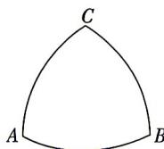

<!-- question-source:start -->
6.[江西上饶一中2025高一月考]数学中处处存在着美,莱洛三角形就给人以对称的美感.莱洛三角形的画法如下:先画等边三角

形 $ABC$ , 再分别以点 $A, B, C$ 为圆心, 线段 $AB$ 长为半径画圆弧, 便得到莱洛三角形 (如图所示). 若莱洛三角形的周长为 $\frac{\pi}{2}$ , 则其面积是 \_\_\_\_.
<!-- question-source:end -->

![[Q00071473A1]]
