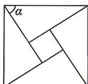

<!-- question-source:start -->
3. [重庆 2026 高一月考] 若 $\beta \in [0, 2\pi)$ , 且 $\sqrt{1 - \cos^2\beta} + \sqrt{1 - \sin^2\beta} = \sin \beta - \cos \beta$ , 则 $\cos \beta$ 的取值范围是 ( )
A. [0,1) B. [-1,0] C. (0,1] D. [-1,0)

<!-- question-source:end -->

![[Q00071510A1]]
