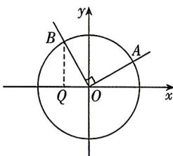
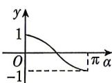
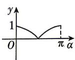
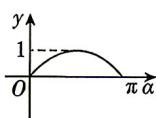
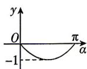

<!-- question-source:start -->
6.[山东省实验中学2025高一段考]如图,在平面直角坐标系中,角 $\alpha(0\leqslant\alpha\leqslant\pi)$ 的始边为x轴的非负半轴,

终边与单位圆的交点为 A, 将 OA 绕坐标原点逆时针旋转 $\frac{\pi}{2}$ 至 OB, 过点 B 作 x 轴的垂线, 垂足为 Q, 记线段 BQ 的长为 y, 则函数 $y = f(\alpha)$ 的图象大致是 ( )

A

B

C

D
<!-- question-source:end -->

![[Q00071542A1]]
