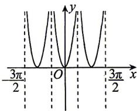
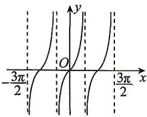
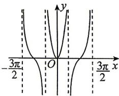
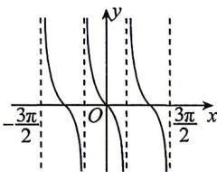

<!-- question-source:start -->
1. 下列图形分别是① $y = |\tan x|$ ; ② $y = \tan x$ ; ③ $y = \tan (-x)$ ; ④ $y = \tan |x|$ 在 $\left(-\frac{3\pi}{2}, \frac{3\pi}{2}\right)$ 内的大致图象, 那么由 a 到 d 对应的函数关系式应是 ( )

a

c

b

d

A. $①②③④$ B. $①③④②$ C. $③②④①$ D. $①②④③$
<!-- question-source:end -->

![[Q00071588A1]]
