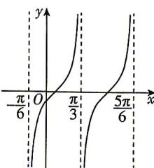

<!-- question-source:start -->
5. (多选) [江西南昌 2026 期末] 已知函数 $f(x) = 4 \tan (\omega x + \varphi) (\omega > 0, 0 < \varphi < \pi)$ 的部分图象如图所示, 则 ( )

生命中的全部偶然,其实都是命中注定。是为宿命。

A. $\omega = 1$ B. $f(x) = 4\tan \left(2x + \frac{5\pi}{6}\right)$ C. $f(x)$ 的图象与 $\gamma$ 轴的交点坐标为 $\left(0, - \frac{4\sqrt{3}}{3}\right)$ D.函数 $y = f(x)$ 的图象关于点 $\left(\frac{7\pi}{3},0\right)$ 对称
<!-- question-source:end -->

![[Q00071601A1]]
