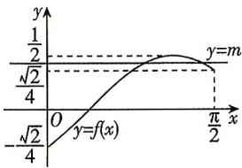

> [!faq]- 答案与解析
>
> > [!success]- **【答案】** A
>
> > [!note]- **【解析】**
> > A 【解析】因为 $\alpha, \beta$ 都是锐角，所以 $-\frac{\pi}{2}<\alpha-\beta<\frac{\pi}{2}$ .
> > 由题意得 $\cos(\alpha-\beta)=\sqrt{1-\left(\frac{\sqrt{10}}{10}\right)^{2}}=$ [244]
> >
> > $\frac{1}{2}\sin \left(2x - \frac{\pi}{4}\right) \in \left[-\frac{\sqrt{2}}{4}, \frac{1}{2}\right]$ , 所以 $f(x)$ 的值域为 $\left[-\frac{\sqrt{2}}{4}, \frac{1}{2}\right]$ 又函数 $f(x)$ 的图象与直线 $y = m (m \in \mathbf{R})$ 有 2 个交点, 作出 $f(x)$ 在 $\left[0, \frac{\pi}{2}\right]$ 内的图象如图,
> >
> > 
> >
> > 由图可知 $\frac{\sqrt{2}}{4} \leqslant m < \frac{1}{2}$ , 所以实数 $m$ 的取值范围为 $\left[\frac{\sqrt{2}}{4}, \frac{1}{2}\right)$ .
