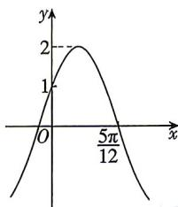

<!-- question-source:start -->
8.[辽宁朝阳2026期末]函数 $f(x)=A\sin(\omega x+\varphi)$ $\left(A>0,\omega>0,0<\varphi<\frac{\pi}{2}\right)$ 的部分图象如图所示,则函数 $f(x)$ 的解析式为()

A. $f(x) = 2\cos \left(2x + \frac{\pi}{3}\right)$ B. $f(x) = 2\sin \left(2x + \frac{\pi}{6}\right)$ C. $f(x) = 2\cos \left(2x - \frac{\pi}{3}\right)$ D. $f(x) = 2\sin \left(2x + \frac{5\pi}{6}\right)$

## 题型5 函数 $y = A\sin (\omega x + \varphi)$ 的图象与性质的综合
<!-- question-source:end -->

![[Q00071713A1]]
