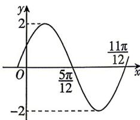

<!-- question-source:start -->
17. [陕西榆林 2026 高一期末] 已知函数 $f(x) = A \sin (\omega x + \varphi) (A > 0, \omega > 0, |\varphi| < \pi)$ 的部分图象如图所示.
(1) 求函数 $f(x)$ 的解析式；
(2) 求 $f(x)$ 的单调递增区间；
(3) 若函数 $g(x)$ 与 $f(x)$ 的图象关于直线 $x = \frac{\pi}{12}$ 对称，求不等式 $g(x) \geqslant g\left(\frac{\sqrt{3}}{2}\right)$ 的解集.

<!-- question-source:end -->

![[Q00071722A1]]
