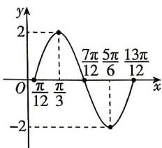

> [!faq]- 答案与解析
>
> > [!success]- **【答案】** 详见解析
>
> > [!note]- **【解析】**
> > 【解】(1)由题意得, $f(x)=2\sqrt{3}\sin x\cos x-2\cos^{2}x+1=\sqrt{3}\sin 2x-(2\cos^{2}x-1)=\sqrt{3}\sin 2x-\cos 2x=2\sin\left(2x-\frac{\pi}{6}\right)$
> >
> > (2)列表如下：
> >
> > <table><tr><td> $2x-\frac{\pi}{6}$ </td><td>0</td><td> $\frac{\pi}{2}$ </td><td> $\pi$ </td><td> $\frac{3\pi}{2}$ </td><td> $2\pi$ </td></tr><tr><td>x</td><td> $\frac{\pi}{12}$ </td><td> $\frac{\pi}{3}$ </td><td> $\frac{7\pi}{12}$ </td><td> $\frac{5\pi}{6}$ </td><td> $\frac{13\pi}{12}$ </td></tr><tr><td>f(x)</td><td>0</td><td>2</td><td>0</td><td>-2</td><td>0</td></tr></table>
> >
> > ## 5.6 函数 $y = A\sin (\omega x + \varphi)$
> >
> > 描点、连线如图所示.
> >
> > 
> >
> > (3) 当 $x \in \left[0, \frac{5\pi}{12}\right]$ 时， $2x - \frac{\pi}{6} \in \left[-\frac{\pi}{6}, \frac{2\pi}{3}\right]$ ,
> > 而 $\sin\left(-\frac{\pi}{6}\right)=-\frac{1}{2},\sin\frac{\pi}{2}=1,\sin\frac{2\pi}{3}=\frac{\sqrt{3}}{2}$ 因此 $\sin\left(2x-\frac{\pi}{6}\right)\in\left[-\frac{1}{2},1\right]$ 故 $f(x)=2\sin\left(2x-\frac{\pi}{6}\right)$ 的值域为 $[-1,2]$ .
