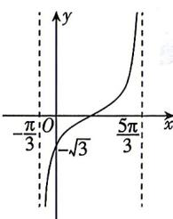

<!-- question-source:start -->
3.[四川成都2026高一月考]已知函数 $f(x)=\tan(\omega x+\varphi)\left(\omega>0,|\varphi|<\frac{\pi}{2}\right)$ 的部分图象如图所示,则 $\omega\varphi=$

A. $\frac{\pi}{3}$ B. $\frac{\pi}{6}$ C. $-\frac{\pi}{3}$ D. $-\frac{\pi}{6}$
<!-- question-source:end -->

![[Q00071607A1]]
