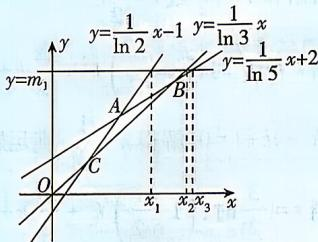
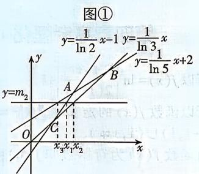
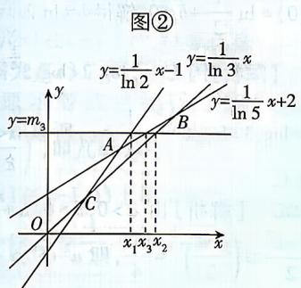
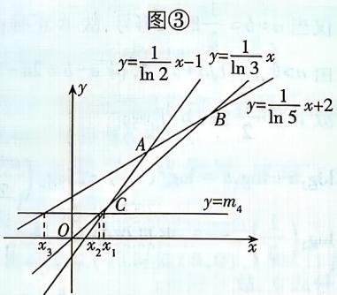

> [!faq]- 答案与解析
>
> > [!success]- **【答案】** B
>
> > [!note]- **【解析】**
> > B
> >
> > 思路导引 思路一: 令 $\log_2 x = 1 + \log_3 y = 3 + \log_5 z = k \rightarrow x = 2^k, y = 3^{k-1}, z = 5^{k-3} \rightarrow$ 分别取 $k = 0, 3, 6$ 可排除选项 A, C, D.
> >
> > 思路二: 令 $x = e^{x_1}, y = e^{x_2}, z = e^{x_3} \rightarrow \frac{1}{\ln 2} x_1 - 1 = \frac{1}{\ln 3} x_2 = \frac{1}{\ln 5} x_3 + 2 \rightarrow$ 在同一平面直角坐标系内画出函数 $y = \frac{1}{\ln 2} x - 1, y = \frac{1}{\ln 3} x, y = \frac{1}{\ln 5} x + 2$ 的大致图象 $\rightarrow$ 数形结合 $\rightarrow x_1, x_2, x_3$ 的大小关系 $\rightarrow x, y, z$ 的大小关系
> >
> > 【解析】由题意知 $\log_2 x = 1 + \log_3 y = 3 + \log_5 z,$ 令 $\log_2 x = 1 + \log_3 y = 3 + \log_5 z = k$ , 则 $x = 2^k, y = 3^{k-1}, z = 5^{k-3}$ ,
> >
> > <table><tr><td>k</td><td>x</td><td>y</td><td>z</td><td>大小关系</td><td>结论</td></tr><tr><td>0</td><td>1</td><td> $\frac{1}{3}$ </td><td> $\frac{1}{125}$ </td><td>x&gt;y&gt;z</td><td>A 正确</td></tr><tr><td>3</td><td>8</td><td>9</td><td>1</td><td>y&gt;x&gt;z</td><td>C 正确</td></tr><tr><td>6</td><td>64</td><td>243</td><td>125</td><td>y&gt;z&gt;x</td><td>D 正确</td></tr></table>
> >
> > 下面证明:选项B错误.
> > 若 x > z，则 $2^{k} > 5^{k-3}$ ，即 $\left(\frac{5}{2}\right)^{k} < 5^{3}$ ，两边同时取自然对数，得 $k \ln \frac{5}{2} < 3 \ln 5$ ，即 $k < \frac{3 \ln 5}{\ln \frac{5}{2}}$ ；若 z > y，则 $5^{k-3} > 3^{k-1}$ ，即 $\left(\frac{5}{3}\right)^{k-1} > 5^{2}$ ，两边同时取自然对数，得 $(k-1) \ln \frac{5}{3} > 2 \ln 5$ ，即 $k > \frac{2 \ln 5}{\ln \frac{5}{3}} + 1$ （下面比较 $\frac{3 \ln 5}{\ln \frac{5}{2}}$ 和 $\frac{2 \ln 5}{\ln \frac{5}{3}} + 1$ 的大小）。因为 $\frac{3 \ln 5}{\ln \frac{5}{2}} - \left(\frac{2 \ln 5}{\ln \frac{5}{3}} + 1\right) = \frac{3 \ln 5}{\ln \frac{5}{2}} - \frac{2 \ln 5}{\ln \frac{5}{3}} - 1 = \frac{\ln 5 \left(3 \ln \frac{5}{3} - 2 \ln \frac{5}{2}\right)}{\ln \frac{5}{2} \ln \frac{5}{3}} - 1,$ 因为 $\left(\frac{5}{3}\right)^{3}-\left(\frac{5}{2}\right)^{2}=\frac{125}{27}-\frac{25}{4}=-\frac{175}{108}<0,$ 所以 $\left(\frac{5}{3}\right)^{3}<\left(\frac{5}{2}\right)^{2}$ ，即 $3\ln\frac{5}{3}<2\ln\frac{5}{2}$ ，
> > 所以 $\frac{3\ln5}{\ln\frac{5}{2}}<\frac{2\ln5}{\ln\frac{5}{3}}+1,$ 所以 $k<\frac{3\ln5}{\ln\frac{5}{2}}$ 与 $k>\frac{2\ln5}{\ln\frac{5}{3}}+1$ 不可能同时成立，故B错误.
> > 故选B.
> >
> > 多种解法 令 $x = \mathrm{e}^{x_1}, y = \mathrm{e}^{x_2}, z = \mathrm{e}^{x_3}$ , 比较 $x, y, z$ 的大小, 只需比较 $x_1, x_2, x_3$ 的大小. 由题意得, $2 + \log_2\mathrm{e}^{x_1} = 3 + \log_3\mathrm{e}^{x_2} = 5 + \log_5\mathrm{e}^{x_3}$ , 即 $2 + \frac{1}{\ln 2} x_1 = 3 + \frac{1}{\ln 3} x_2 = 5 + \frac{1}{\ln 5} x_3$ , 即 $\frac{1}{\ln 2} x_1 - 1 = \frac{1}{\ln 3} x_2 = \frac{1}{\ln 5} x_3 + 2.$ 在同一平面直角坐标系内画出函数 $y = \frac{1}{\ln 2} x - 1, y = \frac{1}{\ln 3} x$ 和 $y = \frac{1}{\ln 5} x + 2$ 的大致图象, 如图所示 $\left(\frac{1}{\ln 2} > \frac{1}{\ln 3} > \frac{1}{\ln 5}\right)$ .
> >
> > 
> >
> > 
> >
> > 
> >
> > 
> > 图④
> >
> > 设直线 $y=\frac{1}{\ln2}x-1$ 与直线 $y=\frac{1}{\ln5}x+2$ 的交点为 A，直线 $y=\frac{1}{\ln2}x-1$ 与直线 $y=\frac{1}{\ln3}x$ 的交点为 C，直线 $y=\frac{1}{\ln3}x$ 与直线 $y=\frac{1}{\ln5}x+2$ 的交点为 B.
> > 如图①: 当 $y = m_{1}$ (直线 $y = m_{1}$ 在点 B 的上方) 时, 此时 $x_{3} > x_{2} > x_{1}$ , 即 z > y > x, 选项中没有;
> > 如图②: 当 $y = m_{2}$ (直线 $y = m_{2}$ 在点 C 的上方, 且在点 A 的下方) 时, 此时 $x_{2} >$ $x_{1}>x_{3}$ ，即 y>x>z，排除 C；
> > 如图③: 当 $y=m_{3}$ (直线 $y=m_{3}$ 在点 A 的上方, 且在点 B 的下方) 时, 此时 $x_{2}>x_{3}>x_{1}$ , 即 y>z>x, 排除 D;
> > 如图④: 当 $y=m_{4}$ (直线 $y=m_{4}$ 在点 C 的下方) 时, 此时 $x_{1}>x_{2}>x_{3}$ , 即 x>y>z, 排除 A. 不存在选项 B 的情况.
> > 故选 B.
> >
> > 故选B.
> >
> > 链接教材 本题是教材第140页习题4.4第4题的变式与延伸,综合考查对数式比较大小.本题也可以根据图象变换,画出 $x=2^{k},y=3^{k-1},z=5^{k-3}$ 的图象大致走向,结合图象的高低、特殊点的函数值、交点进行判断.近几年高考题目增强了试题的探索性、综合性与解法的开放性.此题可以举特例进行排除,也可以利用函数与方程的思想,数形结合求解.
