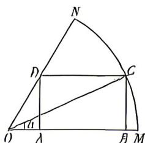

<!-- question-source:start -->
12.[河北唐山2026高一月考]近年来,某市认真践行“绿水青山就是金山银山”的生态文明理念,围绕良好的生态禀赋和市场需求,深挖冷水鱼产业发展优势潜力,现已摸索出以虹鳟、鲟鱼等养殖为主方向.为扩大养殖规模,某鲟鱼养殖场计划在如图所示的扇形区域MON内修建矩形水池ABCD,矩形一边AB在OM上,点C在 $\widehat{MN}$ 上,点D在边ON上,且 $\angle MON=\frac{\pi}{3},OM=60$ 米,设 $\angle COM=\alpha$ .

(1) 若 $a = \frac{\pi}{4}$ , 求 $OD$ 的长.

(2) 若矩形 $ABCD$ 的面积为 $S(\alpha)$ , 当 $\alpha$ 为何值时, $S(\alpha)$ 取得最大值? 并求出这个最大值.

<!-- question-source:end -->

![[Q00071692A1]]
