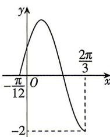

<!-- question-source:start -->
2.[湖南长沙外国语学校2026高一期末]已知函数 $f(x)=2\cos(\omega x+\varphi)\left(\omega>0,|\varphi|\leqslant\frac{\pi}{2}\right)$ 的部分图象如图所示,将 $f(x)$ 的图象上所有点的横坐标缩短到原来的 $\frac{1}{2}$ ,纵坐标不变,得到函数 $g(x)$ 的图象,则()

A. $g(x) = 2\cos \left(x - \frac{\pi}{3}\right)$ B. $g(x) = 2\cos \left(x + \frac{\pi}{6}\right)$ C. $g(x) = 2\cos \left(4x - \frac{\pi}{3}\right)$ D. $g(x) = 2\cos \left(4x + \frac{\pi}{6}\right)$

<!-- question-source:end -->

![[Q00071724A1]]
