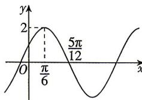

<!-- question-source:start -->
7. (多选)[黑龙江哈尔滨三中2026高一期末]已知函数 $f(x)=A\sin(\omega x+\varphi)\left(A>0,\omega>0,|\varphi|<\frac{\pi}{2}\right)$ 的部分图象如图所示,则() A. $\varphi=\frac{\pi}{6}$ B. 函数 $f(x)$ 在区间 $\left(-\frac{\pi}{3},\frac{\pi}{3}\right)$ 上不单调 C. 若 $x\in\left[-\frac{\pi}{2},\frac{\pi}{12}\right]$ ，则函数 $f(x)$ 的值域是 $[-1,\sqrt{3}]$ D. $y=2\cos\left(2x-\frac{5\pi}{6}\right)$ 的图象可以由 $y=f(x)$ 的图象向右平移 $\frac{\pi}{4}$ 个单位长度得到

<!-- question-source:end -->

![[Q00071729A1]]
