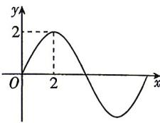

<!-- question-source:start -->
10.[江苏常州一中2026高一月考]函数 $f(x)=A\sin(\omega x+\varphi)(A>0,\omega>0)$ 的部分图象如图所示,则 $f(1)+f(2)+f(3)+\cdots+f(100)=$ \_\_\_\_.

<!-- question-source:end -->

![[Q00071732A1]]
