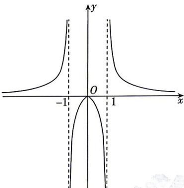

<!-- question-source:start -->
3.[天津2025·3,5分]已知函数 $y=f(x)$ 的图象如图所示,则 $f(x)$ 的解析式可能为()

A. $f(x) = \frac{x}{1 - |x|}$ B. $f(x) = \frac{x}{|x| - 1}$ C. $f(x) = \frac{|x|}{1 - x^2}$ D. $f(x) = \frac{|x|}{x^2 - 1}$
<!-- question-source:end -->

![[Q00071148A1]]
