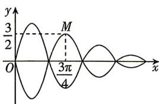

<!-- question-source:start -->
3. 新考向 创新情境 [北京人大附中 2025 质量检测] 音乐喷泉曲线形似藤蔓上挂结的葫芦, 也可称为葫芦曲线, 它的性质是每经过相同的时间间隔, 它的振幅就变化一次. 如图所示, 某一条葫芦曲线对应的方程为 $|y| = \left(2 - \frac{1}{2}\left[\frac{2x}{\pi}\right]\right) |\sin \omega x|, x \geqslant 0, \omega \in (1,3)$ , 其中 $[x]$ 表示不超过 $x$ 的最大整数. 若该曲线还满足经过点 $M\left(\frac{3}{4}\pi, \frac{3}{2}\right)$ , 则该葫芦曲线与直线 $x = \frac{7}{6}\pi$ 交点的纵坐标为 ( )

A. $\pm \frac{1}{2}$ B. $\pm \frac{\sqrt{2}}{2}$ C. $\pm \frac{\sqrt{3}}{2}$ D. $\pm 1$
<!-- question-source:end -->

![[Q00071755A1]]
