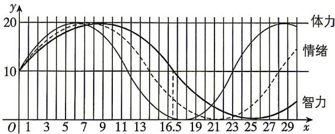

<!-- question-source:start -->
4. (多选)[重庆巴蜀中学 2025 月考]从出生之日起,人的体力、情绪、智力呈周期性变化,假设在前 30 天内,它们的变化规律如图所示(均为可向右无限延伸的正弦型曲线模型):

记智力曲线为 $I$ ，情绪曲线为 $E$ ，体力曲线为 $P$ 且三条曲线的起点位于坐标系的同一点处，则（）A.体力曲线 $P$ 的最小正周期是三条曲线中最小的B.第94天时，情绪值小于15C.第462天时，智力曲线 $I$ 与情绪曲线 $E$ 都处于上升期D.不存在正整数 $n$ ，使得第 $n$ 天时，智力、情绪、体力三条曲线同时处于最高点或最低点
<!-- question-source:end -->

![[Q00071756A1]]
