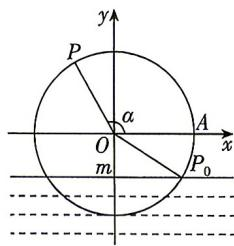

<!-- question-source:start -->
7.[浙江金华2026高一月考]如图为一个水轮的轴截面示意图,水轮的半径为1米,水轮圆心O距离水面m米.以圆心O为坐标原点,平行于水面的直径所在直线为x轴,垂直于水面的直径所在直线为y轴建立平面直角坐标系.已知水轮每分钟逆时针转动5圈,如果当水轮上点P从水中浮现时(图中点 $P_{0}$ )开始计算时间.

(1) 当 $m = \frac{1}{4}$ ，点 P 在转动过程中第一次使得 $\left|PP_{0}\right|=\sqrt{3}$ 时，记水轮与 x 轴交于点 A， $\angle AOP=\alpha$ , 求此时 $\cos\left(\alpha-\frac{\pi}{6}\right)$ 的值；

(2) 当 $m=\frac{1}{2}$ 时, 求点 P 距离水面的高度 y (单位: m) 关于时间 t (单位: 秒) 的函数, 并求点 P 第一次到达最高点时所需要的时间.

## 刷易错

## 易错点 求错函数模型
<!-- question-source:end -->

![[Q00071759A1]]
