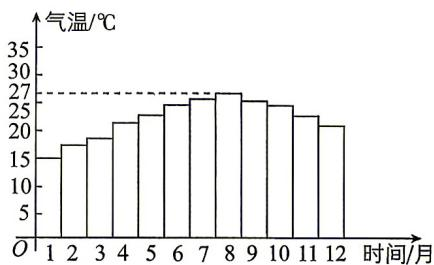

<!-- question-source:start -->
9. 某地为发展旅游事业, 在旅游手册中给出了当地一年 12 个月每个月的平均气温 $y$ (单位: ℃), 如图所示. 根据图中提供的数据, 试用 $y = A \sin (\omega x + \varphi) + b (A > 0, \omega > 0, -\pi < \varphi < 0)$ 近似地拟合出月平均气温 $y$ 与时间 $x$ (单位: 月) 的函数关系式为 \_\_\_\_, $x = 1, 2, \cdots, 12$ .

视频讲解

拍照批改

## 刷速度

## 一、单项选择题:本大题共8小题,每小题5分,共40分.在每小题给出的四个选项中,只有一项是符合题目要求的.
<!-- question-source:end -->

![[Q00071761A1]]
