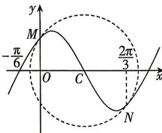

<!-- question-source:start -->
7. 函数 $f(x) = A \sin (\omega x + \varphi) (A > 0, \omega > 0, 0 < \varphi < \pi)$ 的部分图象如图中实线所示, 图中圆 $C$ 与 $f(x)$ 的图象交于 $M, N$ 两点, 且 $M$ 在 $y$ 轴上, 则下列说法正确的是 ( )

A. 若圆 C 的半径为 $\frac{5\pi}{12}$ ，则 $f(x)=\frac{\sqrt{3}\pi}{6}\cdot\sin\left(2x+\frac{\pi}{3}\right)$ B. 函数 $f(x)$ 在 $\left(-\frac{7\pi}{12}, -\frac{\pi}{3}\right)$ 上单调递减
C. 函数 $f(x)$ 的图象向左平移 $\frac{\pi}{12}$ 个单位长度后得到的图象关于直线 $x=\frac{\pi}{4}$ 对称
D. 函数 $f(x)$ 的最小正周期是 $\frac{10\pi}{9}$
<!-- question-source:end -->

![[Q00071768A1]]
