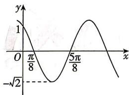

<!-- question-source:start -->
16. (本小题满分 15 分) [黑龙江哈尔滨 2026 高一期末] 已知函数 $f(x) = A \cos (\omega x + \varphi) \left( A > 0, 0 < \varphi < \frac{\pi}{2} \right)$ 的部分图象如图所示.
(1) 求 $f(x)$ 的解析式；
(2) 求 $f(x)$ 的单调递增区间与 $f(x)$ 在区间 $\left[-\frac{\pi}{4},\frac{\pi}{4}\right]$ 上的值域.

<!-- question-source:end -->

![[Q00071776A1]]
