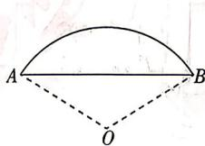

<!-- question-source:start -->
7. 定义运算: $\left| \begin{array}{cc}a & b\\ c & d \end{array} \right| = ad - bc.$ 已知 $\left| \begin{array}{ll}\sin \alpha & \cos 180^{\circ}\\ \cos \alpha & \tan 60^{\circ} \end{array} \right| = \sin (270^{\circ} + \alpha)$ , 则 $\tan \alpha =$ （ ）A. $\frac{\sqrt{3}}{2}$ B. $\frac{2\sqrt{3}}{3}$ C. $-\frac{\sqrt{3}}{2}$ D. $-\frac{2\sqrt{3}}{3}$

## 8.[山东济南山东师范大学附属中学2026高一月考]《九章算术》是我国古代的数学

名著,其中《方田》一章记录了弧田面积的计算问题.如图,某弧田由弧AB和其所对的弦AB围成,若弦AB长度为2,弧AB所对的圆心角的弧度数为2,则该弧田的面积为( )
A. $\frac{1}{\tan1}$ B. $\frac{1}{\sin^{2}1}$ C. $\frac{1}{\cos^{2}1}-\frac{1}{\tan1}$ D. $\frac{1}{\sin^{2}1}-\frac{1}{\tan1}$

## 9. [新考法 创新角度] [江西鹰潭贵溪一中 2026 高一月考] 若定义域均为 $D$ 的函数 $f(x), g(x)$ 满足: 人间骄阳正好, 风过林梢, 彼时他们正当年少。

$\exists x_{1},x_{2}\in D$ ，且 $x_{2} - x_{1}\in (-m,m)$ ，使得 $f(x_{1}) = g(x_{2}) = 0$ ，则称 $f(x)$ 与 $g(x)$ 互为“ $m$ 亲近函数”.已知均定义在 $(-1, + \infty)$ 上的函数 $f(x) = \ln (x + 1)$ 与 $g(x) = \cos^2 x - a\cos x + 1$ 互为“ $\frac{\pi}{2}$ 亲近函数”，则实数 $a$ 的取值范围是 （）A.[-1,1] B.(-2,2)C. $(-\infty , - 2]\cup [2, + \infty)$ D.[2,+∞）
<!-- question-source:end -->

![[Q00071810A1]]
