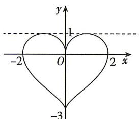

<!-- question-source:start -->
3.[河南省实验中学2026高一期中]如图是一个“心形”图形,这个图形可看作由两个函数的图象构成,则“心形”在x轴上方的图象对应的函数解析式可能为()

A. $y = |x|\sqrt{4 - x^2}$ B. $y = x\sqrt{4 - x^2}$ C. $y = \sqrt{-x^2 + 2|x|}$ D. $y = \sqrt{-x^2 + 2x}$

<!-- question-source:end -->

![[Q00071817A1]]
