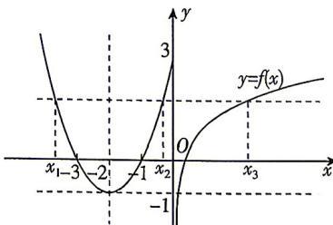

> [!faq]- 答案与解析
>
> > [!success]- **【答案】** A
>
> > [!note]- **【原始答案】** ②③
>
> > [!note]- **【解析】**
> > 当 $x \leqslant 0$ 时, $f(x)$ 的图象是开口向上、对称轴为直线 $x = -2$ 的抛物线 $y = x^2 + 4x + 3$ 在 $y$ 轴及 $y$ 轴左侧的部分；当 $x > 0$ 时, $f(x)$ 的图象由对数函数 $y = \log_3 x$ 的图象向上平移 1 个单位长度而得到. 综上可得 $f(x)$ 的大致图象如图所示.
> >
> > 
> > - **对于①**：, 观察图象知, 当 $t > 3$ 时, 方程 $f(x) = t$ 只有2个实数根, ①错误;
> > - **对于②**：, 当 $x_0 > 0$ 时, 要使得 $f(-x_0) = f(x_0)$ 成立, 即 $y = x^2 - 4x + 3 (x > 0)$ 与 $y = 1 + \log_3 x$ 的图象在 $(0, +\infty)$ 上有交点, 而 $y = x^2 - 4x + 3 (x > 0)$ 的图象与 $y = x^2 + 4x + 3 (x < 0)$ 的图象关于 $y$ 轴对称, 显然 $y = x^2 - 4x + 3 (x > 0)$ 的图象与函数 $y = 1 + \log_3 x$ 的图象有公共点, ②正确;
> > - **对于③**：, 不妨设互不相等的实数 $x_1, x_2, x_3$ 的大小关系为 $x_1 < x_2 < x_3$ , 当满足 $f(x_1) = f(x_2) = f(x_3)$ 时, 由图象可知 $\frac{x_1 + x_2}{2} = -2$ , 即 $x_1 + x_2 = -4$ , 当 $x > 0$ 时, 令 $f(x) = -1$ , 即 $1 + \log_3 x = -1$ , 解得 $x = \frac{1}{9}$ , 当 $x > 0$ 时, 令 $f(x) = 3$ , 即 $1 + \log_3 x = 3$ , 解得 $x = 9$ , 因此 $\frac{1}{9} < x_3 \leqslant 9$ , 所以 $-\frac{35}{9} < x_1 + x_2 + x_3 \leqslant 5$ , ③正确. 所以所有正确结论的序号是②③.
