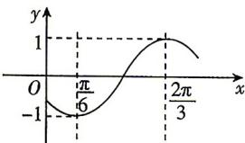

> [!faq]- 答案与解析
>
> > [!success]- **【答案】** D
>
> > [!note]- **【解析】**
> > D 【解析】由题意画出 $f(x)$ 图象的简图（如图）.
> >
> > 
> >
> > 因为函数 $f(x) = \sin (\omega x + \varphi)$ 在区间 $\left(\frac{\pi}{6},\frac{2\pi}{3}\right)$ 单调递增，且直线 $x = \frac{\pi}{6}$ 和直线 $x = \frac{2\pi}{3}$ 为函数 $y = f(x)$ 的图象的两条对称轴，所以 $\frac{2\pi}{3} -\frac{\pi}{6} = \frac{T}{2},f\left(\frac{\pi}{6}\right) = -1$ ，所以 $T = \pi$ ，即 $|\omega | = \frac{2\pi}{T} = 2$ ，则 $\omega = 2$ 或-2.而 $f\left(\frac{\pi}{6}\right) = -1$ ，即 $\sin \left(2\times \frac{\pi}{6} +\varphi\right) = -1$ 或 $\sin \left(-2\times \frac{\pi}{6} +\varphi\right) = -1$ ，所以 $2\times \frac{\pi}{6}+$ $\varphi = -\frac{\pi}{2} +2k\pi$ 或 $-2\times \frac{\pi}{6} +\varphi = -\frac{\pi}{2} +2k\pi ,$ $k\in \mathbf{Z},$ 即 $\varphi = -\frac{5\pi}{6} +2k\pi$ 或 $-\frac{\pi}{6} +2k\pi ,k\in$ $\mathbf{Z},$ 所以 $f(x) = \sin \left(2x - \frac{5\pi}{6}\right)$ 或 $f(x) =$ $\sin \left(-2x - \frac{\pi}{6}\right)$ ，所以 $f\left(-\frac{5\pi}{12}\right) =$ $\sin \left(-\frac{5\pi}{6} -\frac{5\pi}{6}\right) = \sin \left(-\frac{5\pi}{3}\right) = \sin \frac{\pi}{3} =$ $\frac{\sqrt{3}}{2}$ 或 $f\left(-\frac{5\pi}{12}\right) = \sin \left(\frac{5\pi}{6} -\frac{\pi}{6}\right) = \frac{\sqrt{3}}{2},$
> >
> > 故选 **D**.
