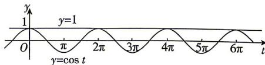

> [!faq]- 答案与解析
>
> > [!success]- **【答案】** [2,3)
>
> > [!note]- **【解析】**
> > 令 $f(x) = \cos \omega x - 1 = 0$ ，得 $\cos \omega x = 1$ ，又 $x \in [0,2\pi]$ ，则 $\omega x \in [0,2\omega \pi]$ ，令 $t = \omega x \in [0,2\omega \pi]$ ，因为 $f(x)$ 在 $[0,2\pi]$ 有且仅有3个零点，所以 $y = \cos t$ 的图象与直线 $y = 1$ 在 $[0,2\omega \pi]$ 有且仅有3个交点，如图，所以 $4\pi \leqslant 2\omega \pi < 6\pi$ ，解得 $2 \leqslant \omega < 3$ ，即 $\omega$ 的取值范围是[2,3).
> >
> > 
> >
> > 多种解法 令 $f(x) = \cos \omega x - 1 = 0 (\omega > 0)$ ，得 $\cos \omega x = 1$ ，即 $\omega x = 2k\pi (\omega > 0)$ ， $k \in \mathbf{Z}$ ，解得 $x = \frac{2k\pi}{\omega} (\omega > 0)$ ， $k \in \mathbf{Z}$ . 因为 $f(x)$ 在区间 $[0, 2\pi]$ 有且仅有 3 个零点，且 $f(0) = 0$ ，所以 $f(x)$ 的 3 个零点对应 $k = 0, 1, 2$ ，所以 $f\left(\frac{2\pi}{\omega}\right) = f\left(\frac{4\pi}{\omega}\right) = 0$
> >
> > 且 $\frac{4\pi}{\omega} \leqslant 2\pi < \frac{6\pi}{\omega}$ , 解得 $2 \leqslant \omega < 3$ , 即 $\omega$ 的取值范围是[2,3).
