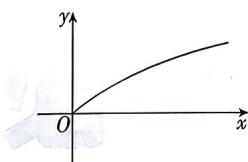

<!-- question-source:start -->
17. (本小题满分 15 分) [江苏南京六校 2025 高一联考] 某校为了鼓励学生利用业余时间阅读名著, 预备制定一个每日阅读考核评分制度, 建立一个每日得分 $y$ (单位: 分) 与当日阅读时间 $x$ (单位: 分) 的函数关系. 要求如下:
(i) 函数的部分图象接近图示;
(ii) 每日阅读时间为 0 分钟时, 当日得分为 0 分;
(iii) 每日阅读时间为 30 分钟时, 当日得分为 3 分;
(iv) 每日阅读最多得分不超过 6 分.
现有以下三个函数模型供选择:
① $y = kx + m (k > 0)$ ;
② $y = k \cdot 1.1^x + m (k > 0)$ ;
③ $y = k\log_2\left(\frac{x}{15} + 2\right) + m (k > 0)$ .
(1) 请你根据函数图象性质, 从中选择一个合适的函数模型, 不需要说明理由.
(2) 根据你对 (1) 的判断以及所给信息, 写出合适函数模型的解析式.
(3) 若该校要求每日的得分不少于 5 分, 问每日至少阅读名著多少分钟? (结果精确到整数)
注: $2^{\frac{8}{3}} \approx 6.35$ .

<!-- question-source:end -->

![[Q00071409A1]]
