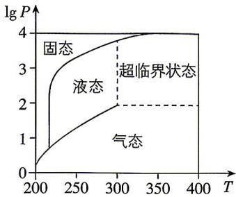

<!-- question-source:start -->
25.[北京 2022·7,4 分]在北京冬奥会上,国家速滑馆“冰丝带”使用高效环保的二氧化碳跨临界直冷制冰技术,为实现绿色冬奥作出了贡献.如图描述了一定条件下二氧化碳所处的状态与 T 和 lg P 的关系,其中 T 表示温度,单位是 K;P 表示压强,单位是 bar.下列结论中正确的是()

A. 当 $T = 220, P = 1026$ 时, 二氧化碳处于液态
B. 当 $T = 270, P = 128$ 时, 二氧化碳处于气态
C. 当 $T = 300, P = 9987$ 时, 二氧化碳处于超临界状态
D. 当 $T = 360, P = 729$ 时, 二氧化碳处于超临界状态

答案 P226

(2) 若不等式 $f(x) \cdot \left(mx + \frac{n}{x} + p\right) \leqslant 0$ 恒成立，求 $mp + n$ 的最大值.

# 第五章
<!-- question-source:end -->

![[Q00071439A1]]
