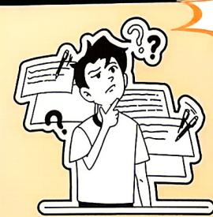
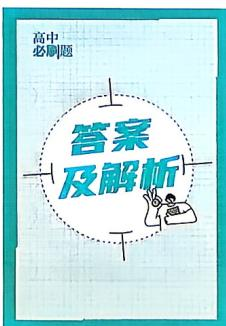

<!-- source-part:1 pages:1-50 -->

# 高中 2026—2027学年 总主编：杨文彬 主编：赵成海等 必刷题®

含新定义、开放题等

配
狂K重点

AI赋能，“码”上提分

AI秒批改 ▶ 类题智能推

预习卡·提升学习效率

视频讲解▶ 做题不卡壳

数学

必修 第一册 RJ

配人教A版

# 高分，必须是刷出来的！

会 但又总
束手无策
要科学刷题!

有没有人和我一样，一抬头，数学老师的板书就变成5天书很想学学不会……
等诗CPU烧干？你需

## 数学这个难题有且仅有一个解

## 为什么要刷题？

新高一想走出“新手村”，就需要通过刷题来“叠buff”。刷题主要有两个目的：一是检验自己对教材知识、技能、方法的掌握程度；二是提升题感，刷出“肌肉记忆”，即一看到一类题就能理出思路，做到驾轻就熟。前者是“刷刷题看哪儿还不会”，后者是“不会的一类题多刷多练”。从做对的题目中巩固自身所学，从做错的题目中发现自身问题并破解，才能获得刷题的成就感。

## 大招≠高分

数学难题防不胜防，after math后总感到创伤，多么希望有灵丹妙药可以治愈所有伤口。然而！药不对症，只会套大招结论，傻傻分不清奇变偶不变，奇穿偶不穿到底是什么奇什么偶；左加右减和同增异减到底是谁在加，谁在减？当然也想不通数学高分到底谁在考？拒绝机械套用结论、盲从大招，刷清其中逻辑思想，小小数学，轻松拿下。

## 只刷必刷的题

刷题并不意味着“题海战术”，题是刷不完的，需要我们只刷真正有价值的题目。必刷题中每一道“天选之题”，按照难易度、知识点关联性、易错程度等整合在不同的小栏目中，环环相扣，构建起多方位多层次的训练体系。如果这些题你觉得太难，那么请在考试后回来复盘，你会发现题目和考题难度相当。不要因为总选错答案而畏惧刷题，关注解题过程和方法，认真分析错题原因并及时纠正，才能做到有效刷题。

刷题人背后有必刷题，必刷题背后是全国一线名师对内容的层层打磨，为每个努力刷题的你，千千万万遍地推敲。

## 更多小绿书资源扫码获取

新增电子预习卡

每课一页，预习自测

打印更好用

## 自bibh 配套上分视频，尽在必刷题课代表

## B站搜索：必刷题课代表

必刷精讲

重难考法

#备考资源

#教考新讯

真题分析

#福利派送

# 高中 2026—2027学年 必刷题®

总主编：杨文彬

主 编：赵成海 戴桂良

编者：黄志军 王军 湛力 郭自朝 滕文秀 高文倩
刘卫东 刘超 汤小梅 梁兰兰 崔文艺 桑永利
余强 李国强 刘向东 吴昊 夏康 王金贵
吴玲玲 廖庆伟 鲁棣松 马艳 胡磊 邱蕊
朱读应 熊焕军 安博 韩利侠 汪亮亮 谭倩
殷成斌 王欢 王蓉 杨育池 郭凯强 石宏丹
李宗彦 束观元

审订：马进才 董祥桥 张继云 赵成海 屈锡金 李静王晓玲 董朝军 胡景林 张新严 曾晓琴 杨玲贺勇 付强 闫东兴 刘江勇 白亚斌 谭彩绒杨国伟 王骞

刷题人：\_\_\_\_

必修 第一册 RJ

## CONTENTS 目录

第一章 集合与常用逻辑用语

1.1 集合的概念 …… 刷基础 (1) (147)
1.2 集合间的基本关系 …… 刷基础 刷提升 (3) (148)
1.3 集合的基本运算 …… 刷基础 刷提升 (5) (150)
第 1.1 \~ 1.3 节综合训练 …… 刷能力 (7) (152)
专题 1 集合的综合问题 …… 刷难关 (8) (152)
1.4 充分条件与必要条件 …… (9) (153)
1.4.1 充分条件与必要条件 ① 1.4.2 充要条件 …… 刷基础 (9) (153)
第 1.4 节综合训练 …… 刷能力 (11) (154)
1.5 全称量词与存在量词 …… (12) (155)
1.5.1 全称量词与存在量词 …… 刷基础 (12) (155)
1.5.2 全称量词命题和存在量词命题的否定 …… 刷基础 (13) (156)
第 1.5 节综合训练 …… 刷能力 (14) (156)
第一章素养检测 …… 刷速度 (15) (157)
第一章高考强化 …… 刷真题 刷原创 (18) (159)

第二章 一元二次函数、方程和不等式

2.1 等式性质与不等式性质 …… 刷基础 刷能力 (20) (160)
2.2 基本不等式 …… 刷基础 刷能力 (22) (162)
专题 2 利用基本不等式求最值 …… 刷难关 (25) (166)
2.3 二次函数与一元二次方程、不等式 …… 刷基础 刷能力 (26) (167)
第二章素养检测 …… 刷速度 (29) (170)
第二章高考强化 …… 刷真题 刷原创 (32) (172)

第三章 函数的概念与性质

3.1 函数的概念及其表示 …… (33) (173)
3.1.1 函数的概念 …… 刷基础 刷提升 (33) (173)
3.1.2 函数的表示法 …… 刷基础 刷提升 (36) (176)
第 3.1 节综合训练 …… 刷能力 (39) (178)
3.2 函数的基本性质 …… (40) (179)
3.2.1 单调性与最大(小)值 …… (40) (179)
课时 1 函数的单调性 …… 刷基础 (40) (179)
课时 2 函数的最大(小)值 …… 刷基础 刷提升 (42) (180)
3.2.2 奇偶性 …… 刷基础 刷提升 (45) (183)
第 3.2 节综合训练 …… 刷能力 (48) (185)
专题 3 函数的性质及应用 …… 刷难关 (49) (186)
3.3 幂函数 …… 刷基础 刷能力 (51) (188)

## CONTENTS 目录

3.4 函数的应用(一) …… 刷基础 刷能力 (54)(191)
第三章素养检测 …… 刷速度 (57)(192)
第三章高考强化 …… 刷真题 刷原创 (60)(195)

4.1 指数 …… (62)(196)
4.1.1 n次方根与分数指数幂 4.1.2 无理数指数幂及其运算
性质 …… 刷基础 刷提升 (62)(196)
4.2 指数函数 …… (64)(198)
4.2.1 指数函数的概念 …… 刷基础 (64)(198)
4.2.2 指数函数的图象和性质 …… 刷基础 刷提升 (65)(198)
第4.1, 4.2节综合训练 …… 刷能力 (68)(201)
4.3 对数 …… (69)(202)
4.3.1 对数的概念 4.3.2 对数的运算 … 刷基础 刷提升 (69)(202)
4.4 对数函数 …… (71)(203)
4.4.1 对数函数的概念 4.4.2 对数函数的图象和性质
…… 刷基础 刷提升 (71)(203)
4.4.3 不同函数增长的差异 …… 刷基础 (75)(207)
第4.3, 4.4节综合训练 …… 刷能力 (76)(208)
专题4 指数函数、对数函数 …… 刷难关 (77)(209)
4.5 函数的应用(二) …… (79)(212)
4.5.1 函数的零点与方程的解 …… 刷基础 刷提升 (79)(212)
4.5.2 用二分法求方程的近似解 …… 刷基础 (83)(216)
4.5.3 函数模型的应用 …… 刷基础 刷提升 (84)(216)
第4.5节综合训练 …… 刷能力 (87)(218)
第四章素养检测 …… 刷速度 (89)(220)
第四章高考强化 …… 刷真题 刷原创 (92)(223)

5.1 任意角和弧度制 …… (95)(226)
5.1.1 任意角 …… 刷基础 (95)(226)
5.1.2 弧度制 …… 刷基础 (96)(227)
第5.1节综合训练 …… 刷能力 (98)(229)
5.2 三角函数的概念 …… (99)(230)
5.2.1 三角函数的概念 …… 刷基础 (99)(230)
5.2.2 同角三角函数的基本关系 …… 刷基础 (100)(230)
第5.2节综合训练 …… 刷能力 (102)(232)

## CONTENTS 目录

5.3 诱导公式 …… 刷基础 刷能力 (103) (233)
5.4 三角函数的图象与性质 …… (105) (235)
5.4.1 正弦函数、余弦函数的图象 …… 刷基础 刷提升 (105) (235)
5.4.2 正弦函数、余弦函数的性质 …… (107) (236)
课时1 正弦函数、余弦函数的性质(1) …… 刷基础 (107) (236)
课时2 正弦函数、余弦函数的性质(2) … 刷基础 刷提升 (108) (237)
5.4.3 正切函数的性质与图象 …… 刷基础 刷提升 (111) (240)
第5.4节综合训练 …… 刷能力 (113) (242)
5.5 三角恒等变换 …… (115) (244)
5.5.1 两角和与差的正弦、余弦和正切公式 …… (115) (244)
课时1 两角和与差的正弦、余弦和正切公式 … 刷基础 刷提升 (115) (244)
课时2 二倍角的正弦、余弦、正切公式 … 刷基础 刷提升 (118) (247)
5.5.2 简单的三角恒等变换 …… 刷基础 (120) (249)
第5.5节综合训练 …… 刷能力 (121) (251)
专题5 三角恒等变换 …… 刷难关 (123) (253)
5.6 函数 $y = A \sin(\omega x + \varphi)$ …… (124) (255)
5.6.1 匀速圆周运动的数学模型 ⑤ 5.6.2 函数 $y = A \sin(\omega x + \varphi)$ 的图象 …… 刷基础 (124) (255)
第5.6节综合训练 …… 刷能力 (127) (257)
专题6 求 $\omega$ 的值或取值范围 …… 刷难关 (129) (259)
5.7 三角函数的应用 …… 刷基础 刷能力 (130) (261)
第五章素养检测 …… 刷速度 (134) (263)
第五章高考强化 …… 刷真题 刷原创 (138) (266)

…… 刷素养 (141) (269)
…… 刷素养 (143) (271)
…… 刷综合 (144) (272)

找深度解析还得看

## 易错警示

81个『易错警示』，将小细节一网打尽，快收下这份 $360^{\circ}$ 避坑指南！
·多种解法
30个『多种解法』，拒绝僵化，灵活领先，多种思路，多种可能。
·链接教材
回归教材，25个『链接教材』，助你夯实基础，以不变应万变！
·思路导引
不再纠结于繁杂过程，20个『思路导引』直击破题点和隐含条件，助你一路绿灯。
·规律方法
天才解题可不是靠乱猜的！68个『规律方法」帮你找规律，有捷径才能事半功倍。
·名师点拨
老师点一点，玄机自然显。23个『名师点拨」，老师的专属秘笈都属于你！

## 重难专题

专题① 集合的综合问题 …… 8

题型1 已知集合间的关系和运算结果求参数

题型2 集合中的新定义问题

题型3 直观想象、逻辑推理、数学运算等核心素养在求解集合问题中的应用

专题② 利用基本不等式求最值 …… 25

题型1 求简单代数式的最值

题型2 利用配凑法求最值

题型3 利用“1”的代换求最值

题型4 和积转化法

题型5 利用消元法或换元法求最值

专题③ 函数的性质及应用 …… 49

题型1 分段函数的应用

题型2 函数的单调性、奇偶性与最值

题型3 函数的周期性和图象的对称性

题型4 抽象函数的性质综合

专题④ 指数函数、对数函数 …… 77

题型1 利用指数函数、对数函数的性质比较大小

·角度1 利用指数函数性质比较指数(式)大小

·角度2 利用对数函数性质比较对数(式)大小

·角度3 简单的指数、对数综合比较大小

·角度4 利用新构造函数的单调性比较大小

题型2 指数函数与对数函数的图象

题型3 应用指数函数、对数函数的性质确定参数的值或范围

专题⑤ 三角恒等变换 …… 123

题型1 三角变换之变角

题型2 三角变换之变名

题型3 三角变换之升幂与降幂

专题⑥ 求 ω 的值或取值范围 …… 129

题型1 已知单调性求 ω 的取值范围

题型2 已知对称性求 ω 的值或取值范围

题型3 已知零点求 ω 的取值范围

题型4 已知最值点求 ω 的取值范围

## 重难就要刷又刷

## 高考新动向·科技前沿、创新情境

数据检索与笛卡尔积 …… P8 第 3 题
不同购买习惯下平均单价的比较 …… P21 第 5 题
糖水不等式的理解与应用 …… P21 第 8 题
AI 大模型训练效率的分析 …… P55 第 10 题
机器人分拣快递与人工分拣的对比 …… P56 第 5 题
牛顿三叉戟曲线的性质研究 …… P59 第 19 题
量子计算机的量子比特数量的计算 …… P70 第 5 题
人工智能大模型算力估计 …… P84 第 2 题

由碳14残余量估计文物年代 …… P84第3题
人工智能模型总迭代次数估计 …… P85第7题
手机低电量模式下的使用时间估计 …… P89第5题
“赵爽弦图”中三角函数值的计算 …… P102第4题
判断声音函数的周期 …… P114第9题
葫芦曲线与直线交点纵坐标的判断 …… P132第3题
根据声波图象判断模型 …… P132第5题
判断“心形”图形的解析式 …… P144第3题

## 高考新动向·模块融合

取整函数与一元二次不等式、充分必要条件的综合
…… P28 第 9 题
幂函数与一次函数、基本不等式的综合 …… P53 第 6 题
根据对称中心的结论判断与指数有关函数的对称
中心及应用 ……… P67 第 8 题
幂函数、余弦函数性质的综合与对数式、三角式
比较大小 ……… P113 第 5 题

二次函数、正弦函数性质与集合的综合
P114 第 13 题
对数函数性质与三角函数性质综合比较大小
P135 第 8 题
对数函数与余弦函数的性质综合 …… P142 第 9 题
基本不等式与指、对、幂运算的综合求最值
P145 第 10 题

## 高考新动向·新定义

新定义集合中的元素之和 …… P2 第 18 题
集合中的新定义——奇、偶子集个数的计算
…… P4 第 8 题
“交汇函数”定义的理解 …… P35 第 6 题
“p 界函数”与函数性质的综合 …… P48 第 4 题

“基点对”的理解与应用 …… P80 第 21 题
莱洛三角形的面积计算 …… P98 第 6 题
双曲正弦函数和双曲余弦函数的性质研究
…… P141 第 6 题
切比雪夫多项式与三倍角公式 …… P142 第 10 题

## 强基计划

【厦门大学2024强基计划】判断满足条件的集合 …… P2第19题
【南京大学2024强基计划】判断集合中的元素个数 …… P2第20题
【2025全国中学生数学奥林匹克竞赛（预赛）】判断两集合交集的元素个数 …… P6第9题
【清华大学2025强基计划】求代数式的最值 …… P24第10题
【北京大学2025强基计划】求代数式的最值 …… P24第11题
【2026中国科学技术大学少年班创新班入围考】根据不等式恒成立求参数范围 …… P28第10题
【北京大学2025强基计划】求含参函数的函数值 …… P35第9题
【2026中国科学技术大学少年班创新班入围考】根据二次函数定义域、值域求参数范围 …… P44第8题
【西安交通大学2025强基计划】求函数的最小值 …… P50第14题
【清华大学2023强基计划】对数的运算 …… P70第12题
【中国科学技术大学2025强基计划】求方程实数解的个数 …… P82第16题
【东南大学2025强基计划】求与三角函数有关方程解的个数 …… P110第14题
【清华大学2024强基计划】三角恒等变换求角 …… P122第15题
【山东大学2025强基计划】三角恒等变换求正弦值 …… P122第16题
【北京大学2025强基计划】三角恒等变换求正切值 …… P122第17题

# 第一章

![[高中/课堂同步/教辅/必刷题/2027版 高中必刷题数学必修第一册RJA/01_第一章_集合与常用逻辑用语/1_1_集合的概念/1_1_集合的概念.md]]
![[高中/课堂同步/教辅/必刷题/2027版 高中必刷题数学必修第一册RJA/01_第一章_集合与常用逻辑用语/1_2_集合间的基本关系/1_2_集合间的基本关系.md]]
![[高中/课堂同步/教辅/必刷题/2027版 高中必刷题数学必修第一册RJA/01_第一章_集合与常用逻辑用语/1_3_集合的基本运算/1_3_集合的基本运算.md]]
![[高中/课堂同步/教辅/必刷题/2027版 高中必刷题数学必修第一册RJA/01_第一章_集合与常用逻辑用语/第_1_1___1_3_节综合训练/第_1_1___1_3_节综合训练.md]]
![[高中/课堂同步/教辅/必刷题/2027版 高中必刷题数学必修第一册RJA/01_第一章_集合与常用逻辑用语/专题_1_集合的综合问题/专题_1_集合的综合问题.md]]
![[高中/课堂同步/教辅/必刷题/2027版 高中必刷题数学必修第一册RJA/01_第一章_集合与常用逻辑用语/1_4_充分条件与必要条件/1_4_充分条件与必要条件.md]]
![[高中/课堂同步/教辅/必刷题/2027版 高中必刷题数学必修第一册RJA/01_第一章_集合与常用逻辑用语/1_4_1_充分条件与必要条件_①_1_4_2_充要条件/1_4_1_充分条件与必要条件_①_1_4_2_充要条件.md]]
![[高中/课堂同步/教辅/必刷题/2027版 高中必刷题数学必修第一册RJA/01_第一章_集合与常用逻辑用语/第_1_4_节综合训练/第_1_4_节综合训练.md]]
![[高中/课堂同步/教辅/必刷题/2027版 高中必刷题数学必修第一册RJA/01_第一章_集合与常用逻辑用语/1_5_全称量词与存在量词/1_5_全称量词与存在量词.md]]
![[高中/课堂同步/教辅/必刷题/2027版 高中必刷题数学必修第一册RJA/01_第一章_集合与常用逻辑用语/1_5_1_全称量词与存在量词/1_5_1_全称量词与存在量词.md]]
![[高中/课堂同步/教辅/必刷题/2027版 高中必刷题数学必修第一册RJA/01_第一章_集合与常用逻辑用语/1_5_2_全称量词命题和存在量词命题的否定/1_5_2_全称量词命题和存在量词命题的否定.md]]
![[高中/课堂同步/教辅/必刷题/2027版 高中必刷题数学必修第一册RJA/01_第一章_集合与常用逻辑用语/第_1_5_节综合训练/第_1_5_节综合训练.md]]
![[高中/课堂同步/教辅/必刷题/2027版 高中必刷题数学必修第一册RJA/01_第一章_集合与常用逻辑用语/第一章素养检测/第一章素养检测.md]]
![[高中/课堂同步/教辅/必刷题/2027版 高中必刷题数学必修第一册RJA/01_第一章_集合与常用逻辑用语/第一章高考强化/第一章高考强化.md]]
![[高中/课堂同步/教辅/必刷题/2027版 高中必刷题数学必修第一册RJA/02_第二章_一元二次函数_方程和不等式/2_1_等式性质与不等式性质/2_1_等式性质与不等式性质.md]]
![[高中/课堂同步/教辅/必刷题/2027版 高中必刷题数学必修第一册RJA/02_第二章_一元二次函数_方程和不等式/2_2_基本不等式/2_2_基本不等式.md]]
![[高中/课堂同步/教辅/必刷题/2027版 高中必刷题数学必修第一册RJA/02_第二章_一元二次函数_方程和不等式/专题_2_利用基本不等式求最值/专题_2_利用基本不等式求最值.md]]
![[高中/课堂同步/教辅/必刷题/2027版 高中必刷题数学必修第一册RJA/02_第二章_一元二次函数_方程和不等式/2_3_二次函数与一元二次方程_不等式/2_3_二次函数与一元二次方程_不等式.md]]
![[高中/课堂同步/教辅/必刷题/2027版 高中必刷题数学必修第一册RJA/02_第二章_一元二次函数_方程和不等式/第二章素养检测/第二章素养检测.md]]
![[高中/课堂同步/教辅/必刷题/2027版 高中必刷题数学必修第一册RJA/02_第二章_一元二次函数_方程和不等式/第二章高考强化/第二章高考强化.md]]
![[高中/课堂同步/教辅/必刷题/2027版 高中必刷题数学必修第一册RJA/03_第三章_函数的概念与性质/3_1_函数的概念及其表示/3_1_函数的概念及其表示.md]]
![[高中/课堂同步/教辅/必刷题/2027版 高中必刷题数学必修第一册RJA/03_第三章_函数的概念与性质/3_1_1_函数的概念/3_1_1_函数的概念.md]]
![[高中/课堂同步/教辅/必刷题/2027版 高中必刷题数学必修第一册RJA/03_第三章_函数的概念与性质/3_1_2_函数的表示法/3_1_2_函数的表示法.md]]
![[高中/课堂同步/教辅/必刷题/2027版 高中必刷题数学必修第一册RJA/03_第三章_函数的概念与性质/第_3_1_节综合训练/第_3_1_节综合训练.md]]
![[高中/课堂同步/教辅/必刷题/2027版 高中必刷题数学必修第一册RJA/03_第三章_函数的概念与性质/3_2_函数的基本性质/3_2_函数的基本性质.md]]
![[高中/课堂同步/教辅/必刷题/2027版 高中必刷题数学必修第一册RJA/03_第三章_函数的概念与性质/3_2_1_单调性与最大_小_值/3_2_1_单调性与最大_小_值.md]]
![[高中/课堂同步/教辅/必刷题/2027版 高中必刷题数学必修第一册RJA/03_第三章_函数的概念与性质/课时_1_函数的单调性/课时_1_函数的单调性.md]]
![[高中/课堂同步/教辅/必刷题/2027版 高中必刷题数学必修第一册RJA/03_第三章_函数的概念与性质/课时_2_函数的最大_小_值/课时_2_函数的最大_小_值.md]]
![[高中/课堂同步/教辅/必刷题/2027版 高中必刷题数学必修第一册RJA/03_第三章_函数的概念与性质/3_2_2_奇偶性/3_2_2_奇偶性.md]]
![[高中/课堂同步/教辅/必刷题/2027版 高中必刷题数学必修第一册RJA/03_第三章_函数的概念与性质/第_3_2_节综合训练/第_3_2_节综合训练.md]]
![[高中/课堂同步/教辅/必刷题/2027版 高中必刷题数学必修第一册RJA/03_第三章_函数的概念与性质/专题_3_函数的性质及应用/专题_3_函数的性质及应用.md]]
![[高中/课堂同步/教辅/必刷题/2027版 高中必刷题数学必修第一册RJA/03_第三章_函数的概念与性质/3_3_幂函数/3_3_幂函数.md]]
![[高中/课堂同步/教辅/必刷题/2027版 高中必刷题数学必修第一册RJA/03_第三章_函数的概念与性质/3_4_函数的应用_一_/3_4_函数的应用_一_.md]]
![[高中/课堂同步/教辅/必刷题/2027版 高中必刷题数学必修第一册RJA/03_第三章_函数的概念与性质/第三章素养检测/第三章素养检测.md]]
![[高中/课堂同步/教辅/必刷题/2027版 高中必刷题数学必修第一册RJA/03_第三章_函数的概念与性质/第三章高考强化/第三章高考强化.md]]
![[高中/课堂同步/教辅/必刷题/2027版 高中必刷题数学必修第一册RJA/04_第四章_指数函数与对数函数/4_1_指数/4_1_指数.md]]
![[高中/课堂同步/教辅/必刷题/2027版 高中必刷题数学必修第一册RJA/04_第四章_指数函数与对数函数/4_1_1_n次方根与分数指数幂及4_1_2_无理数指数幂及其运算性质/4_1_1_n次方根与分数指数幂及4_1_2_无理数指数幂及其运算.md]]
![[高中/课堂同步/教辅/必刷题/2027版 高中必刷题数学必修第一册RJA/04_第四章_指数函数与对数函数/4_2_指数函数/4_2_指数函数.md]]
![[高中/课堂同步/教辅/必刷题/2027版 高中必刷题数学必修第一册RJA/04_第四章_指数函数与对数函数/4_2_1_指数函数的概念/4_2_1_指数函数的概念.md]]
![[高中/课堂同步/教辅/必刷题/2027版 高中必刷题数学必修第一册RJA/04_第四章_指数函数与对数函数/4_2_2_指数函数的图象和性质/4_2_2_指数函数的图象和性质.md]]
![[高中/课堂同步/教辅/必刷题/2027版 高中必刷题数学必修第一册RJA/04_第四章_指数函数与对数函数/第4_1__4_2节综合训练/第4_1__4_2节综合训练.md]]
![[高中/课堂同步/教辅/必刷题/2027版 高中必刷题数学必修第一册RJA/04_第四章_指数函数与对数函数/4_3_对数/4_3_对数.md]]
![[高中/课堂同步/教辅/必刷题/2027版 高中必刷题数学必修第一册RJA/04_第四章_指数函数与对数函数/4_4_对数函数/4_4_对数函数.md]]
![[高中/课堂同步/教辅/必刷题/2027版 高中必刷题数学必修第一册RJA/04_第四章_指数函数与对数函数/4_4_1_对数函数的概念及4_4_2_对数函数的图象和性质/4_4_1_对数函数的概念及4_4_2_对数函数的图象和性质.md]]
![[高中/课堂同步/教辅/必刷题/2027版 高中必刷题数学必修第一册RJA/04_第四章_指数函数与对数函数/4_4_3_不同函数增长的差异/4_4_3_不同函数增长的差异.md]]
![[高中/课堂同步/教辅/必刷题/2027版 高中必刷题数学必修第一册RJA/04_第四章_指数函数与对数函数/第4_3__4_4节综合训练/第4_3__4_4节综合训练.md]]
![[高中/课堂同步/教辅/必刷题/2027版 高中必刷题数学必修第一册RJA/04_第四章_指数函数与对数函数/专题4_指数函数_对数函数/专题4_指数函数_对数函数.md]]
![[高中/课堂同步/教辅/必刷题/2027版 高中必刷题数学必修第一册RJA/04_第四章_指数函数与对数函数/4_5_函数的应用_二_/4_5_函数的应用_二_.md]]
![[高中/课堂同步/教辅/必刷题/2027版 高中必刷题数学必修第一册RJA/04_第四章_指数函数与对数函数/4_5_1_函数的零点与方程的解/4_5_1_函数的零点与方程的解.md]]
![[高中/课堂同步/教辅/必刷题/2027版 高中必刷题数学必修第一册RJA/04_第四章_指数函数与对数函数/4_5_2_用二分法求方程的近似解/4_5_2_用二分法求方程的近似解.md]]
![[高中/课堂同步/教辅/必刷题/2027版 高中必刷题数学必修第一册RJA/04_第四章_指数函数与对数函数/4_5_3_函数模型的应用/4_5_3_函数模型的应用.md]]
![[高中/课堂同步/教辅/必刷题/2027版 高中必刷题数学必修第一册RJA/04_第四章_指数函数与对数函数/第4_5节综合训练/第4_5节综合训练.md]]
![[高中/课堂同步/教辅/必刷题/2027版 高中必刷题数学必修第一册RJA/04_第四章_指数函数与对数函数/第四章素养检测/第四章素养检测.md]]
![[高中/课堂同步/教辅/必刷题/2027版 高中必刷题数学必修第一册RJA/04_第四章_指数函数与对数函数/第四章高考强化/第四章高考强化.md]]
![[高中/课堂同步/教辅/必刷题/2027版 高中必刷题数学必修第一册RJA/05_第五章_三角函数/5_1_任意角和弧度制/5_1_任意角和弧度制.md]]
![[高中/课堂同步/教辅/必刷题/2027版 高中必刷题数学必修第一册RJA/05_第五章_三角函数/5_1_1_任意角/5_1_1_任意角.md]]
![[高中/课堂同步/教辅/必刷题/2027版 高中必刷题数学必修第一册RJA/05_第五章_三角函数/5_1_2_弧度制/5_1_2_弧度制.md]]
![[高中/课堂同步/教辅/必刷题/2027版 高中必刷题数学必修第一册RJA/05_第五章_三角函数/第5_1节综合训练/第5_1节综合训练.md]]
![[高中/课堂同步/教辅/必刷题/2027版 高中必刷题数学必修第一册RJA/05_第五章_三角函数/5_2_三角函数的概念/5_2_三角函数的概念.md]]
![[高中/课堂同步/教辅/必刷题/2027版 高中必刷题数学必修第一册RJA/05_第五章_三角函数/5_2_1_三角函数的概念/5_2_1_三角函数的概念.md]]
![[高中/课堂同步/教辅/必刷题/2027版 高中必刷题数学必修第一册RJA/05_第五章_三角函数/5_2_2_同角三角函数的基本关系/5_2_2_同角三角函数的基本关系.md]]
![[高中/课堂同步/教辅/必刷题/2027版 高中必刷题数学必修第一册RJA/05_第五章_三角函数/第5_2节综合训练/第5_2节综合训练.md]]
![[高中/课堂同步/教辅/必刷题/2027版 高中必刷题数学必修第一册RJA/05_第五章_三角函数/5_3_诱导公式/5_3_诱导公式.md]]
![[高中/课堂同步/教辅/必刷题/2027版 高中必刷题数学必修第一册RJA/05_第五章_三角函数/5_4_三角函数的图象与性质/5_4_三角函数的图象与性质.md]]
![[高中/课堂同步/教辅/必刷题/2027版 高中必刷题数学必修第一册RJA/05_第五章_三角函数/5_4_1_正弦函数_余弦函数的图象/5_4_1_正弦函数_余弦函数的图象.md]]
![[高中/课堂同步/教辅/必刷题/2027版 高中必刷题数学必修第一册RJA/05_第五章_三角函数/5_4_2_正弦函数_余弦函数的性质/5_4_2_正弦函数_余弦函数的性质.md]]
![[高中/课堂同步/教辅/必刷题/2027版 高中必刷题数学必修第一册RJA/05_第五章_三角函数/课时1_正弦函数_余弦函数的性质_1_/课时1_正弦函数_余弦函数的性质_1_.md]]
![[高中/课堂同步/教辅/必刷题/2027版 高中必刷题数学必修第一册RJA/05_第五章_三角函数/5_4_3_正切函数的性质与图象/5_4_3_正切函数的性质与图象.md]]
![[高中/课堂同步/教辅/必刷题/2027版 高中必刷题数学必修第一册RJA/05_第五章_三角函数/第5_4节综合训练/第5_4节综合训练.md]]
![[高中/课堂同步/教辅/必刷题/2027版 高中必刷题数学必修第一册RJA/05_第五章_三角函数/5_5_三角恒等变换/5_5_三角恒等变换.md]]
![[高中/课堂同步/教辅/必刷题/2027版 高中必刷题数学必修第一册RJA/05_第五章_三角函数/5_5_1_两角和与差的正弦_余弦和正切公式/5_5_1_两角和与差的正弦_余弦和正切公式.md]]
![[高中/课堂同步/教辅/必刷题/2027版 高中必刷题数学必修第一册RJA/05_第五章_三角函数/5_5_2_简单的三角恒等变换/5_5_2_简单的三角恒等变换.md]]
![[高中/课堂同步/教辅/必刷题/2027版 高中必刷题数学必修第一册RJA/05_第五章_三角函数/第5_5节综合训练/第5_5节综合训练.md]]
![[高中/课堂同步/教辅/必刷题/2027版 高中必刷题数学必修第一册RJA/05_第五章_三角函数/专题5_三角恒等变换/专题5_三角恒等变换.md]]
![[高中/课堂同步/教辅/必刷题/2027版 高中必刷题数学必修第一册RJA/05_第五章_三角函数/5_6_函数_y___A_sin_omega_x___varphi_/5_6_函数_y___A_sin_omega_x___varphi.md]]
![[高中/课堂同步/教辅/必刷题/2027版 高中必刷题数学必修第一册RJA/05_第五章_三角函数/5_6_1_匀速圆周运动的数学模型及5_6_2_函数_y___A_si/5_6_1_匀速圆周运动的数学模型及5_6_2_函数_y___A_.md]]
![[高中/课堂同步/教辅/必刷题/2027版 高中必刷题数学必修第一册RJA/05_第五章_三角函数/第5_6节综合训练/第5_6节综合训练.md]]
![[高中/课堂同步/教辅/必刷题/2027版 高中必刷题数学必修第一册RJA/05_第五章_三角函数/专题6_求_omega_的值或取值范围/专题6_求_omega_的值或取值范围.md]]
![[高中/课堂同步/教辅/必刷题/2027版 高中必刷题数学必修第一册RJA/05_第五章_三角函数/5_7_三角函数的应用/5_7_三角函数的应用.md]]
![[高中/课堂同步/教辅/必刷题/2027版 高中必刷题数学必修第一册RJA/05_第五章_三角函数/第五章素养检测/第五章素养检测.md]]
![[高中/课堂同步/教辅/必刷题/2027版 高中必刷题数学必修第一册RJA/05_第五章_三角函数/第五章高考强化/第五章高考强化.md]]
