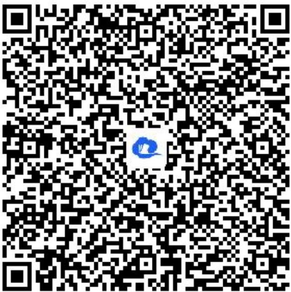

> [!faq]- 《test》例题解析
>
> > [!success]- **【答案】** 详见解析
>
> > [!note]- **【解析】**
> > (1)【问答题】若集合 $A \cup B$ 中有 4 个元素，求实数 a 不可以取的值的集合；
> >
> > (2)【问答题】是否存在实数 $a$ ，使 $B \subseteq A$ ，若存在，求出实数 $a$
> >
> > 的值；若不存在，说明理由.
> >
> > 【正确答案】
> >
> > (1)【问答题】∵ $A = \{1, 2, a^{2}\}$ ， $B = \{1, 2, -a\}$ ， $A \cup B$ 有 4 个元素，
> >
> > $$
> > \therefore A \cup B = \{1, 2, a ^ {2}, - a \}
> > $$
> >
> > $\therefore a^{2} \neq 1, a^{2} \neq 2, a^{2} \neq -a, -a \neq 1, -a \neq 2$
> >
> > $\therefore a \neq \pm 1, a \neq \pm \sqrt{2}, a \neq 0, a \neq -2$
> >
> > ∴ a 不可以取的值的集合为 $\{-2, -\sqrt{2}, -1, 0, 1, \sqrt{2}\}$ .
> >
> > (2)【问答题】若 $B \subseteq A$ ，则 $-a \in A$ ，
> >
> > ∴由集合中元素的互异性知 $-a = a^{2} \neq 1$
> >
> > $\therefore a = 0$ 且 $a \neq -1$
> >
> > 当 $a = 0$ 时， $A = \{0,1,2\}$ ， $B = \{1,2\}$ ， $B \subseteq A$
> >
> > ∴存在实数 a=0，使 $B \subseteq A$ .
> >
> > 【提示】
> >
> > (1)【问答题】解析视频请查看最后一题。
> >
> > 【更多习题信息】
> >
> > 难易度：适中
> >
> > 知识点：元素互异性、利用集合间的关系求参数
> >
> > 【智慧中小学APP扫码查看完整解析】
> >
> > 
