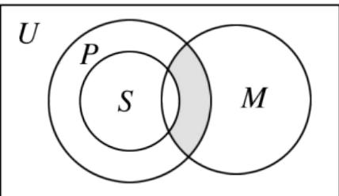

<!-- question-source:start -->
7.【单选题】如图，U为全集，M，P，S是U的三个子集，则阴影部分所表示的集合是（）

A. $(M\cap P)\cap S$ 
B. $(M\cap P)\cup S$ 
C. $(M\cap P)\cap (\partial_U S)$ 
D. $(M\cap P)\cup (\partial_U S)$
<!-- question-source:end -->

![[高中/课堂同步/智慧中小学/必修第一册/第一章 集合与常用逻辑用语/1.3 集合的基本运算/集合的运算/一_单选题/习题/answers/Q00051075A1.md]]
