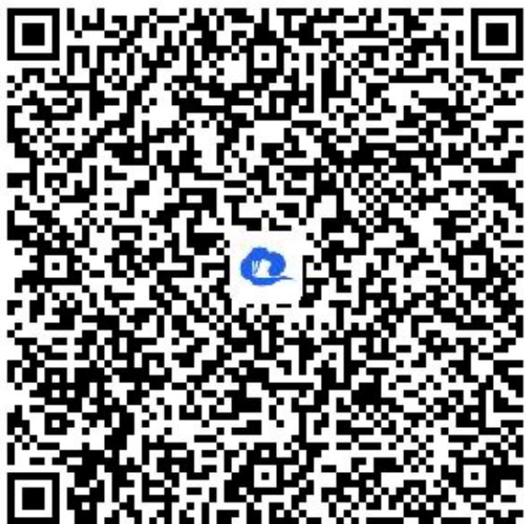

> [!faq]- 《全称量词与存在量词》答案与解析
>
> > [!success]- **【答案】** (1)命题为存在量词命题，假命题
>
> > [!note]- **【解析】**
> > (2)命题为全称量词命题，真命题
> >
> > (3)命题为全称量词命题，假命题
> >
> > (4)命题为存在量词命题，假命题
> >
> > 【更多习题信息】
> >
> > 难易度：适中
> >
> > 知识点：判断命题的类型及真假
> >
> > 【智慧中小学APP扫码查看完整解析】
> >
> > 
