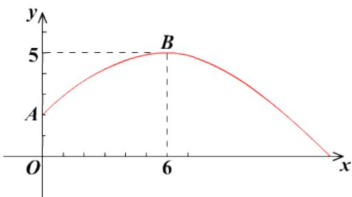

<!-- question-source:start -->
7.【复合题】在体育测试时，一名男同学掷铅球，已知铅球所经过的路径是某个二次函数图象的一部分(如图所示)，这个男同学出手处A点的坐标是 $(0,2)$ ，铅球路线的最高处B

点的坐标是(6, 5).

(1)【问答题】求这个二次函数的解析式;

(2)【问答题】该同学能把铅球掷出去多远(结果精确到0.01 m， $\sqrt{15}\approx3.873$ )？
<!-- question-source:end -->

![[高中/课堂同步/智慧中小学/必修第一册/第三章 函数的概念与性质/3.1.2 函数的表示法/函数三要素的确定_1_/三_复合题/习题/answers/Q00051298A1.md]]
