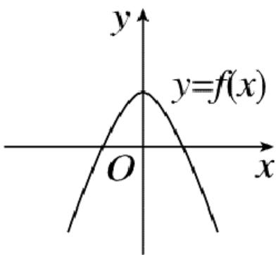
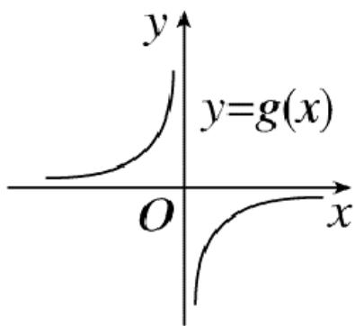
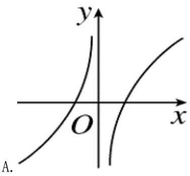
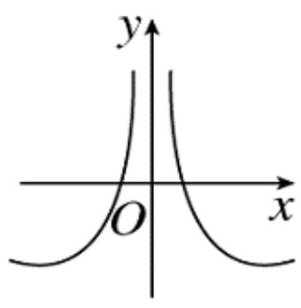
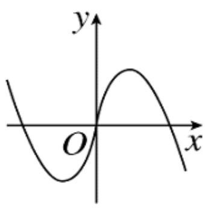
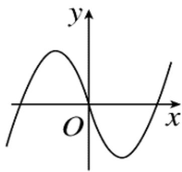

<!-- question-source:start -->
2.【单选题】函数 $y=f_{(x)}$ 与 $y=g(x)$ 的图象如下图，则函数 $y=f_{(x)}\cdot g(x)$ 的图象可能是()

  
B. 

  
C. 

D.
<!-- question-source:end -->

![[高中/课堂同步/智慧中小学/必修第一册/第三章 函数的概念与性质/3.1.2 函数的表示法/函数三要素的确定_2_/一_单选题/习题/answers/Q00051082A1.md]]
