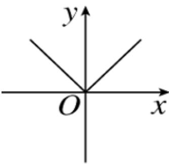
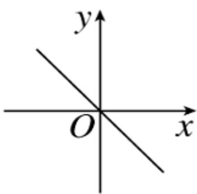
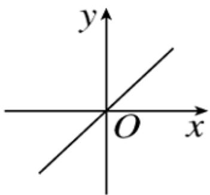
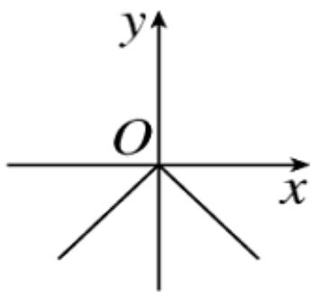

<!-- question-source:start -->
1.【单选题】设 $x \in \mathsf{R}$ ，定义符号函数 $\operatorname{sgn} x = \begin{cases} 1, & x > 0 \\ 0, & x = 0 \\ -1, & x < 0 \end{cases}$ ，则函数 $f(x) = |x| \operatorname{sgn} x$ 的图象大致是（）

A. 

  
B. 

C. 

D.
<!-- question-source:end -->

![[高中/课堂同步/智慧中小学/必修第一册/第三章 函数的概念与性质/3.1.2 函数的表示法/函数三要素的确定_2_/一_单选题/习题/answers/Q00051300A1.md]]
