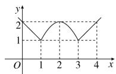

<!-- question-source:start -->
7.【填空题】如图所示，函数图象由两条射线及抛物线的一部分组成，则函数的解析式为

<!-- question-source:end -->

![[高中/课堂同步/智慧中小学/必修第一册/第三章 函数的概念与性质/3.1.2 函数的表示法/函数三要素的确定_2_/三_填空题/习题/answers/Q00051304A1.md]]
