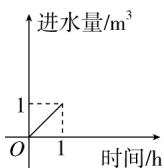
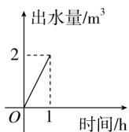
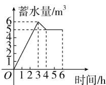

<!-- question-source:start -->
5.【多选题】（多选题）一水池有2个进水口，1个出水口，每个进水口的进水速度如图甲所示，出水口的出水速度如图乙所示．某天从0 h到6

h，该水池的蓄水量如图丙所示，则下列说法正确的是（）

  
甲

  
乙

  
丙

A. 0 h到3 h只进水不出水

B. 3 h到4 h不进水只出水  
C. 3 h到4 h有一个进水口关闭  
D. 4 h到6 h不进水不出水
<!-- question-source:end -->

![[高中/课堂同步/智慧中小学/必修第一册/第三章 函数的概念与性质/3.1.2 函数的表示法/函数三要素的确定_2_/二_多选题/习题/answers/Q00051302A1.md]]
