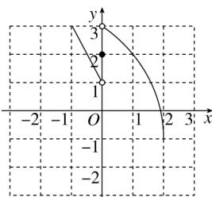

> [!faq]- 《函数三要素的确定（2）》答案与解析
>
> > [!success]- **【答案】** (1)
>
> > [!note]- **【解析】**
> > 
> >
> > (2)【问答题】 $f(a^{2}+1)=3-(a^{2}+1)^{2}=-a^{4}-2a^{2}+2,\quad f(f
> > (3))=f(-6)=13.$
> >
> > (3)【问答题】当x>0时， $3-x^{2}\geq2$ ，解得 $0<x\leq1$ ;
> >
> > 当x=0时， $f(x)=2$ ，满足题意；
> >
> > 当 $x < 0$ 时， $1 - 2x \geq 2$ ，解得 $x \leq -\frac{1}{2}$ .
> >
> > 综上，当 $f(x)\geq2$ 时，x的取值范围为 $\left\{x|x\leq-\frac{1}{2}\text{或}0\leq x\leq1\right\}$ .
> >
> > 【提示】
> >
> > (1)【问答题】解析视频请查看最后一题。
> >
> > (2)【问答题】解析视频请查看最后一题。
> >
> > 【更多习题信息】
> >
> > 难易度：适中
> >
> > 知识点：画函数图像
> >
> > 【智慧中小学APP扫码查看完整解析】
> >
> > 
