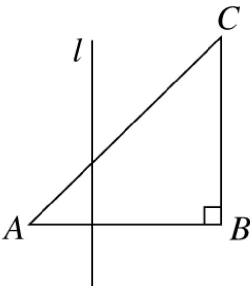
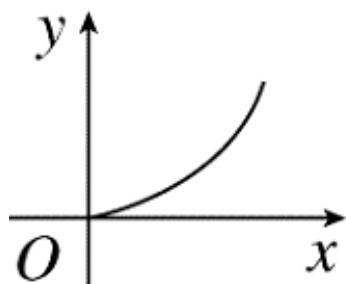
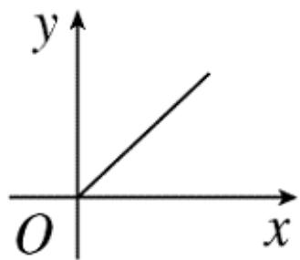
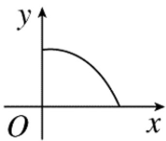
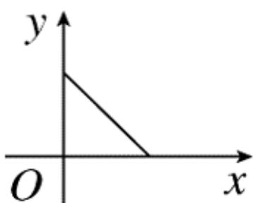

<!-- question-source:start -->
2.【单选题】如图， $\triangle ABC$ 为等腰直角三角形，直线 $l$ 与 $AB$ 相交且 $l \perp AB$ ，设直线 $l$ 截这个三角形所得的位于直线右侧的图形面积为 $y$ ，点 $A$ 到直线1的距离为 $x$ ，则 $y = f(x)$ 的图象大致为（）

A. 

B. 

  
C. 

D.
<!-- question-source:end -->

![[高中/课堂同步/智慧中小学/必修第一册/第三章 函数的概念与性质/3.1.2 函数的表示法/函数表示法/一_单选题/习题/answers/Q00051100A1.md]]
