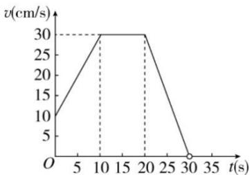

<!-- question-source:start -->
11.【问答题】某质点

内的运动速度v是时间t

的函数，它的图象如图，用解析法表示出这个函数，并求出 9s 时质点的速度.

<!-- question-source:end -->

![[高中/课堂同步/智慧中小学/必修第一册/第三章 函数的概念与性质/3.1.2 函数的表示法/函数表示法/四_问答题/习题/answers/Q00051592A1.md]]
