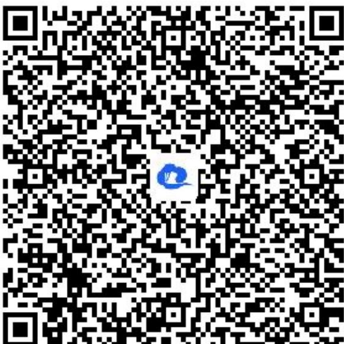

> [!faq]- 《函数的最大（小）值》答案与解析
>
> > [!success]- **【答案】** 详见解析
>
> > [!note]- **【解析】**
> > 【正确答案】令 $\sqrt{x+1}=t$ ，则 $x=t^{2}-1(t\geq0)$ ，所以 $y=t^{2}-t-1(t\geq0)$ 。又 $y=t^{2}-t-1$ 在 $\left[0,\frac{1}{2}\right]$ 上单调递减，在 $\left[\frac{1}{2},+\infty\right)$ 上单调递增，所以 $y_{min}=\left(\frac{1}{2}\right)^{2}-\frac{1}{2}-1=-\frac{5}{4}$ ，无最大值。
> > 故函数 $y=x-\sqrt{x+1}$ 的最小值为 $-\frac{5}{4}$ ，无最大值
> >
> > 【更多习题信息】
> >
> > 难易度：适中
> >
> > 知识点：复合函数的最值
> >
> > 【智慧中小学APP扫码查看完整解析】
> >
> > 
