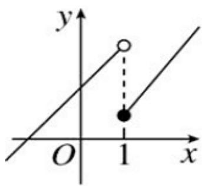
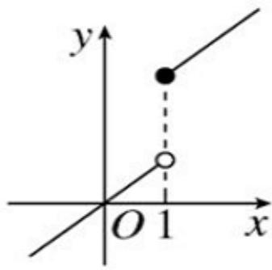
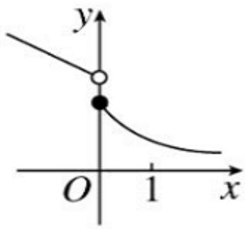
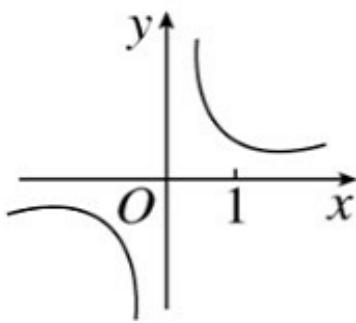

<!-- question-source:start -->
4.【多选题】（多选题）已知四个函数的图象如图所示，其中在定义域内具有单调性的函数是（）

  
A. 

B. 

  
C. 

D.
<!-- question-source:end -->

![[高中/课堂同步/智慧中小学/必修第一册/第三章 函数的概念与性质/3.2.1 单调性与最大（小）值/单调性/二_多选题/习题/answers/Q00051330A1.md]]
