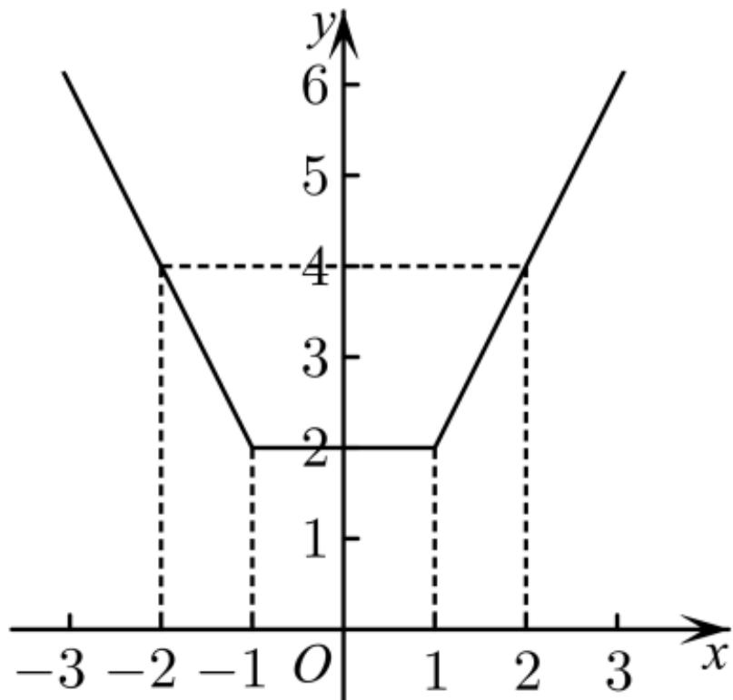

> [!faq]- 《函数的奇偶性》答案与解析
>
> > [!success]- **【答案】** (1)
>
> > [!note]- **【解析】**
> > $f(x)$ 的定义域是 $(-\infty,0)\cup (0, + \infty)$ ，关于原点对称，
> >
> > 又 $f(-x) = (-x)^{3} - \frac{l}{-x} = -\left(x^{3} - \frac{l}{x}\right) = -f(x)$ ，所以 $f(x)$ 是奇函数.
> >
> > (2)【问答题】既不是奇函数也不是偶函数
> >
> > 因为 $f(x)$ 的定义域为 $[-1, 1)$ ，不关于原点对称，
> >
> > 所以 $f(x)$ 既不是奇函数也不是偶函数.
> >
> > (3)【问答题】既是奇函数又是偶函数
> >
> > 因为 $f(x)$ 的定义域为 $\{-\sqrt{3},\sqrt{3}\}$ ，所以 $f(x)=0$ ，
> >
> > 则 $f(x)$ 既是奇函数又是偶函数.
> >
> > (4)【问答题】 偶函数
> >
> > 方法一（定义法） 因为函数 $f(x)$ 的定义域为R，所以函数 $f(x)$ 的定义域关于原点对称.
> > - **①**：当x>1时，-x<-1，所以 $f(-x)=(-2)\times(-x)=2x=f(x)$ ;
> > - **②**：当 $-1 \leqslant x \leqslant 1$ 时， $f(x) = 2;$
> > - **③**：当x<-1时，-x>1，所以 $f(-x)=2\times(-x)=-2x=f(x)$ .
> >
> > 综上，可知函数 $f(x)$ 为偶函数.
> >
> > 方法二（图象法） 作出函数 $f(x)$ 的图象，如图所示，易知函数 $f(x)$ 为偶函数.
> >
> >   
> > 【提示】
> >
> > (1)【问答题】解析视频请查看最后一题。
> >
> > (2)【问答题】解析视频请查看最后一题。
> >
> > (3)【问答题】解析视频请查看最后一题。
> >
> > 【更多习题信息】
> >
> > 难易度：适中
> >
> > 知识点：奇偶性判断
> >
> > 【智慧中小学APP扫码查看完整解析】
> >
> > 
