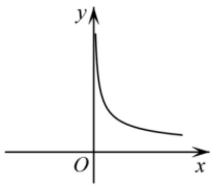
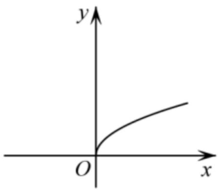
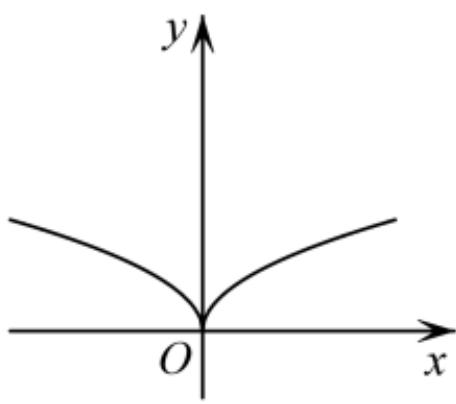
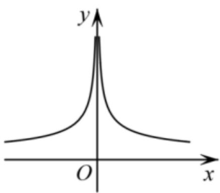

<!-- question-source:start -->
2.【单选题】已知幂函数 $y=f(x)$ 的图象经过点 $P\left(4,\frac{1}{2}\right)$ ，则 $y=f(x)$ 的大致图象是（）

  
A. 

  
B. 

  
C. 

D.
<!-- question-source:end -->

![[高中/课堂同步/智慧中小学/必修第一册/第三章 函数的概念与性质/3.3 幂函数/一_单选题/习题/answers/Q00051109A1.md]]
