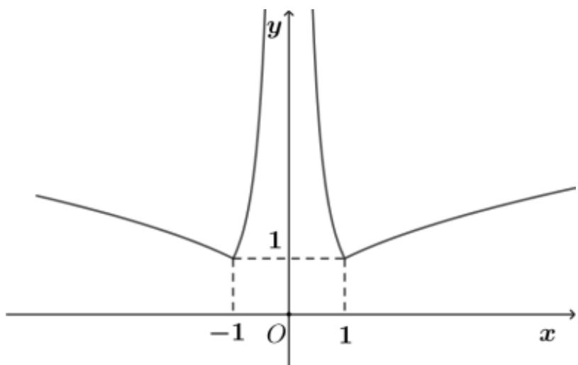
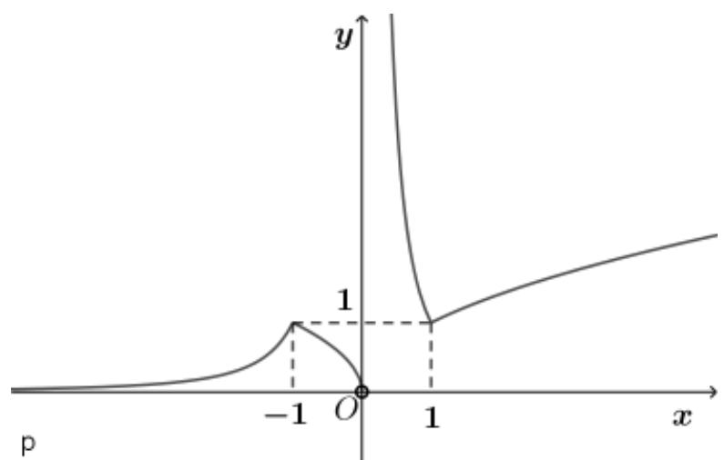
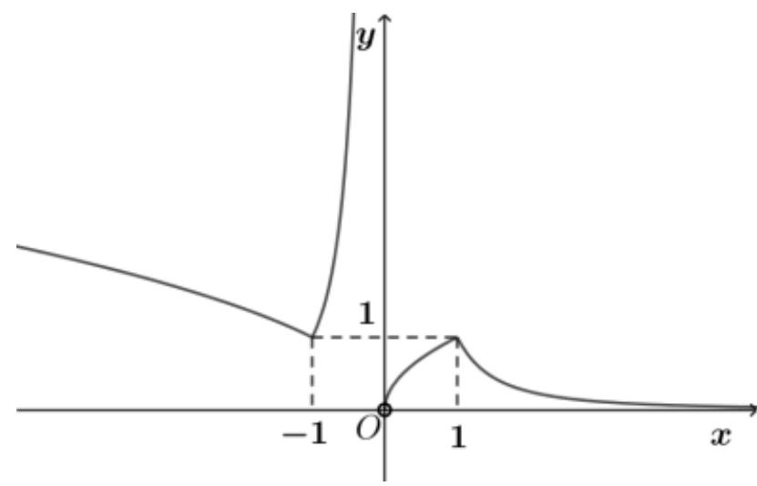
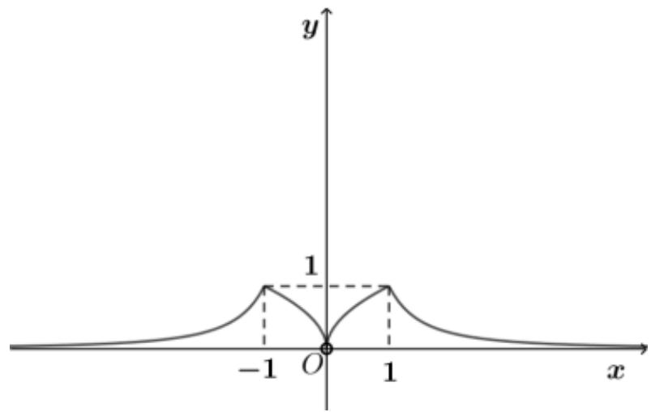

<!-- question-source:start -->
3.【单选题】对 $a, b \in R$ ，记 $max\{a, b\} = \begin{cases} a, & a \geqslant b \\ b, & a < b \end{cases}$ ，函数 $f(x) = max\{\sqrt{|x|}, x^{-2}\}$ 的图象可能是（）

A. 

  
C. 

D.
<!-- question-source:end -->

![[高中/课堂同步/智慧中小学/必修第一册/第三章 函数的概念与性质/3.3 幂函数/一_单选题/习题/answers/Q00051110A1.md]]
