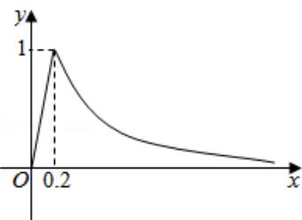

<!-- question-source:start -->
3.【多选题】(多选)为预防流感病毒, 我校每天定时对教室进行喷洒消毒。当教室内每立方米药物含量超 $0.25 \mathrm{mg}$ 时能有效杀灭病毒。已知教室内每立方米空气中的含药量 $y$ (单位: $mg$ ) 随时间 $x$ (单位: $h$ ) 的变化情况如图所示: 在药物释放过程中, $y$ 与 $x$

成正比: 药物释放完毕后, $y$ 与 $x$ 的函数关系式为: $y = \frac{a}{x} (a$ 为常数), 则下列说法正确的是( )

A. 当 $0 \leqslant x \leqslant 0.2$ 时， $y = 5x$ 
B. 当 $x > 0.2$ 时， $y = \frac{1}{5x}$ 
C. 教室内持续有效杀灭病毒时间为0.85小时
D. 喷洒药物3分钟后才开始有效灭杀病毒
<!-- question-source:end -->

![[高中/课堂同步/智慧中小学/必修第一册/第三章 函数的概念与性质/3.4 函数的应用（一）/二_多选题/习题/answers/Q00051341A1.md]]
