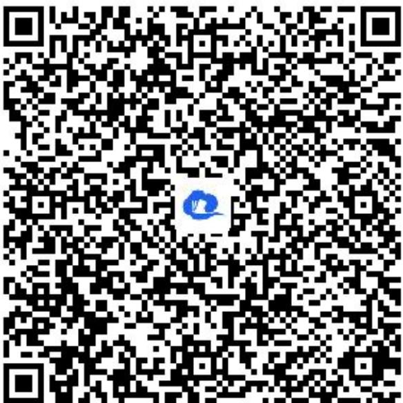

> [!faq]- 《等式性质与不等式性质（1）》答案与解析
>
> > [!success]- **【答案】** $-\frac{\pi}{3} \leqslant \frac{\alpha - \beta}{3} < 0$
>
> > [!note]- **【解析】**
> > 【更多习题信息】
> >
> > 难易度：简单
> >
> > 知识点：利用不等式的性质求取值范围
> >
> > 【智慧中小学APP扫码查看完整解析】
> >
> > 
