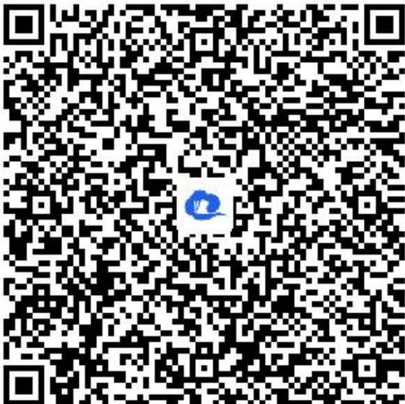

> [!faq]- 《等式性质与不等式性质（2）》答案与解析
>
> > [!success]- **【答案】** $\sqrt{a} +\sqrt{b}\leqslant \frac{a}{\sqrt{b}} +\frac{b}{\sqrt{a}}$ .详细过程见解析视频
>
> > [!note]- **【解析】**
> > 【更多习题信息】难易度：适中知识点：比较大小-作差法【智慧中小学APP扫码查看完整解析】
> >
> > 
